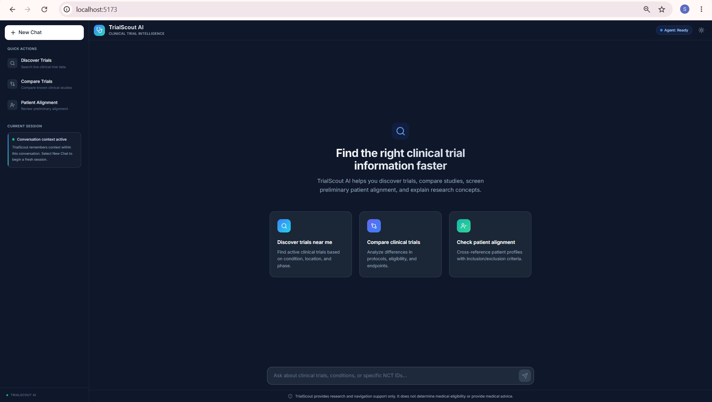
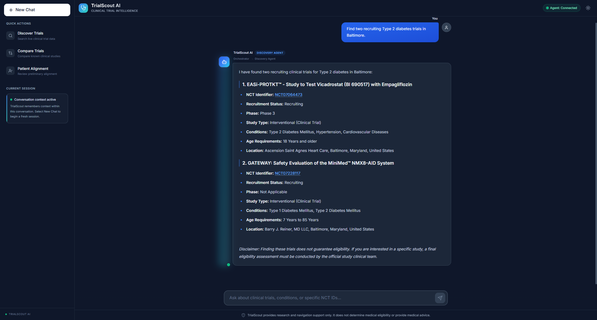
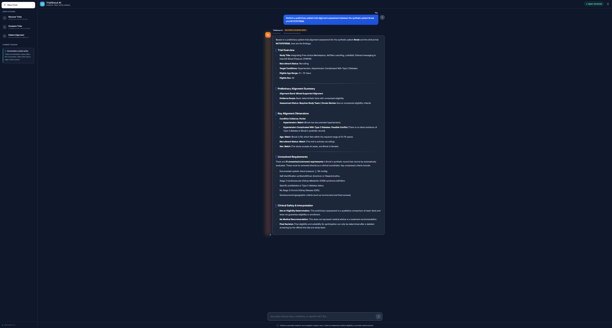
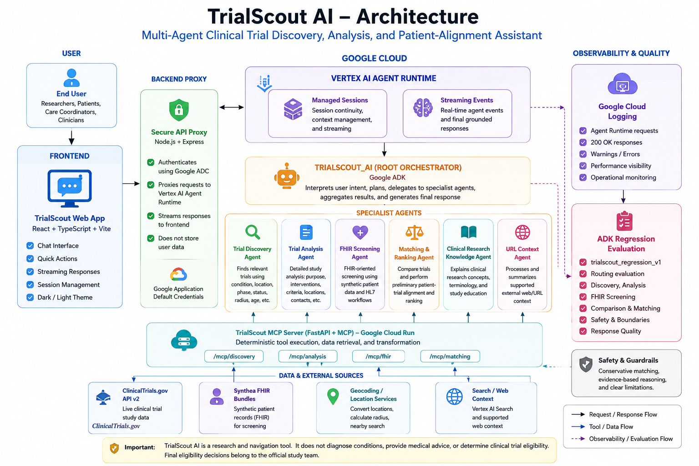
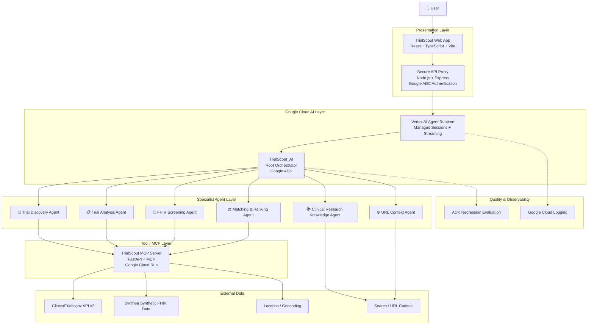

# 🧬 TrialScout AI

### Multi-Agent Clinical Trial Discovery, Analysis, and Patient-Alignment Assistant

TrialScout AI is an end-to-end **agentic AI application for clinical-trial research and navigation** built with Google Agent Development Kit (ADK), Vertex AI Agent Runtime, Model Context Protocol (MCP), Cloud Run, React, and live ClinicalTrials.gov data.

Rather than relying on a single general-purpose chatbot, TrialScout uses a **root orchestration agent and multiple specialist agents** for trial discovery, detailed study analysis, FHIR-oriented patient screening, trial comparison and ranking, and clinical-research education.

> **Important:** TrialScout AI is a research and navigation tool. It does not diagnose conditions, provide medical advice, or determine clinical-trial eligibility. Final eligibility decisions belong to the official study team.

---
## 🖥️ Application Preview

### Home



### Live Trial Discovery & Agent Routing



### Patient Alignment Workflow



## 🏗️ System Architecture



TrialScout AI uses a layered multi-agent architecture combining a React frontend, authenticated Node.js proxy, Vertex AI Agent Runtime, Google ADK orchestration, specialist agents, an MCP tool layer, live ClinicalTrials.gov data, synthetic FHIR patient records, and Google Cloud observability.

## ✨ What TrialScout Can Do

### 🔎 Clinical Trial Discovery

Search live ClinicalTrials.gov data using criteria such as:

- medical condition
- city or geographic location
- recruitment status
- study phase
- patient age
- search radius

Example:

> Find two recruiting Phase 3 diabetes trials near Baltimore.

---

### 📋 Detailed Trial Analysis

Retrieve and explain information for a known clinical trial, including:

- study title and purpose
- sponsor
- interventions
- recruitment status
- phase
- inclusion and exclusion criteria
- study locations
- contact information
- suggested next steps

Example:

> Tell me more about NCT07064473, including the sponsor, interventions, eligibility criteria, and Baltimore contact information.

---

### ⚖️ Trial Comparison & Patient Alignment

Compare multiple studies and perform a conservative, evidence-based preliminary alignment assessment using available patient and protocol information.

The system distinguishes between:

- supported matches
- possible conflicts
- unknown requirements
- criteria requiring human review

It intentionally avoids presenting preliminary matching as medical eligibility.

Example:

> Compare NCT07064473 and NCT07228117 for a 52-year-old adult with Type 2 diabetes.

---

### 🏥 FHIR-Oriented Screening

TrialScout includes healthcare interoperability workflows using **synthetic Synthea patient records represented as FHIR resources**.

These workflows demonstrate:

- structured patient-data interpretation
- FHIR-oriented screening
- deterministic evidence checks
- unresolved eligibility detection
- human-review safeguards

Synthetic patient data is used for development and demonstration. No real patient EHR data is included in the repository.

---

### 📚 Clinical Research Education

A dedicated research-knowledge agent can explain concepts such as:

- clinical trial phases
- recruiting status
- randomization
- placebo/control groups
- inclusion and exclusion criteria
- study participation terminology

---

## 🧠 Multi-Agent Architecture

TrialScout AI uses **Google ADK** to implement a root orchestrator that delegates specialized tasks while maintaining centralized conversation control.



---

## 🤖 Specialist Agents

| Agent | Responsibility |
|---|---|
| **TrialScout_AI** | Root orchestrator that interprets user intent and routes work |
| **Trial Discovery Agent** | Finds relevant studies using live clinical-trial and location data |
| **Trial Analysis Agent** | Performs detailed analysis for identified NCT studies |
| **FHIR Screening Agent** | Handles structured synthetic patient screening and FHIR-related workflows |
| **Matching & Ranking Agent** | Compares trials and performs conservative patient-to-trial alignment |
| **Clinical Research Knowledge Agent** | Explains clinical-research concepts and terminology |
| **URL Context Agent** | Processes supported external web/URL context |

The frontend can surface the actual specialist route observed from Agent Runtime events, for example:

```text
Orchestrator → Discovery Agent
```

This routing indicator is based on real runtime events rather than hard-coded prompt classification in the UI.

---

## 🔌 MCP Tool Layer

TrialScout uses a Model Context Protocol server deployed independently on **Google Cloud Run**.

The server exposes separate capability groups for:

```text
/mcp/discovery/
/mcp/analysis/
/mcp/fhir/
/mcp/matching/
```

The MCP layer performs deterministic data retrieval and transformation while the ADK agents handle orchestration, interpretation, and user-facing explanations.

This separation keeps tool execution independent from conversational reasoning.

---

## 🌐 Live Clinical Trial Data

Trial discovery and study analysis are backed primarily by:

**ClinicalTrials.gov API v2**

This allows TrialScout to retrieve current public study information rather than relying exclusively on a static or mock clinical-trial dataset.

Examples of information retrieved include:

- NCT identifier
- study title
- recruitment status
- phase
- sponsor
- interventions
- conditions
- eligibility criteria
- study locations
- contact details

---

## 🧬 Synthetic FHIR Patient Data

FHIR demonstrations use synthetic patient records generated with **Synthea**.

Example resources are stored under:

```text
data/synthea/
```

Synthetic healthcare data was intentionally selected so that FHIR workflows can be demonstrated without exposing real patient information.

---

## 💻 Web Application

The TrialScout frontend is built with:

- React
- TypeScript
- Vite
- Markdown rendering
- responsive light/dark themes
- streamed agent responses
- runtime session continuity
- specialist-agent routing indicators

Key UI actions include:

- Discover Trials
- Compare Trials
- Patient Alignment
- New Chat

---

## 🔐 Secure Runtime Communication

The browser does not directly manage Google Cloud credentials.

Instead:

```text
Browser
   ↓
Node / Express Proxy
   ↓
Google Application Default Credentials
   ↓
Vertex AI Agent Runtime
```

The backend obtains Google Cloud authentication and securely proxies supported Vertex AI requests from the frontend.

---

## 💬 Conversation Sessions

Vertex AI Agent Runtime provides managed session context.

Within one session, users can ask follow-up questions such as:

```text
User: Find two recruiting Type 2 diabetes trials in Baltimore.

User: Tell me more about the first one.
```

The second request can use the previous conversational context.

Selecting **New Chat** creates a fresh application session.

Persistent cross-session patient memory is intentionally not enabled.

---

## 🧪 Evaluation

TrialScout includes an ADK regression evaluation suite:

```text
trialscout_regression_v1
```

Evaluation scenarios cover important behaviors including:

- specialist routing
- clinical-trial discovery
- trial analysis
- comparison
- patient alignment
- research knowledge
- safety boundaries
- response quality

Evaluation assets are stored under:

```text
tests/eval/
```

Integration and unit testing assets are also included.

---

## 📊 Observability

The deployed Agent Runtime integrates with **Google Cloud Logging**.

Operational logging was verified for:

- Agent Runtime requests
- successful streamed requests
- HTTP `200 OK` responses
- warning/error investigation
- Reasoning Engine runtime activity

This provides operational visibility beyond application-level testing.

---

## 🛠 Technology Stack

### AI / Agent Platform

- Google Agent Development Kit (ADK)
- Vertex AI Agent Runtime
- Gemini
- AgentTool orchestration
- Model Context Protocol (MCP)
- Vertex AI Search / contextual tools

### Backend

- Python
- FastAPI
- MCP
- Node.js
- Express

### Frontend

- React
- TypeScript
- Vite
- React Markdown
- KaTeX / Markdown extensions

### Data & Interoperability

- ClinicalTrials.gov API v2
- HL7 FHIR concepts
- Synthea synthetic patient data
- structured clinical-trial data
- location/geocoding services

### Google Cloud

- Vertex AI
- Agent Runtime
- Cloud Run
- Cloud Logging
- Application Default Credentials
- Terraform deployment assets

---

## 📁 Repository Structure

```text
TrialScout-AI/
│
├── backend/
│   ├── package.json
│   └── server.js
│
├── data/
│   └── synthea/
│
├── deployment/
│   └── terraform/
│
├── frontend/
│   ├── components/
│   ├── services/
│   │   └── agentService.ts
│   ├── App.tsx
│   ├── types.ts
│   └── vite.config.ts
│
├── tests/
│   ├── eval/
│   ├── integration/
│   └── unit/
│
├── trialscout_agent/
│   ├── agent.py
│   ├── fast_api_app.py
│   ├── app_utils/
│   └── trialscout_regression_v1.evalset.json
│
├── Dockerfile
├── Dockerfile.mcp
├── server.py
├── pyproject.toml
├── requirements.txt
└── README.md
```

---

## 🚀 Local Development

### Requirements

You will need:

- Python
- Node.js / npm
- Google Cloud SDK
- authenticated Google Cloud Application Default Credentials

### Authenticate Google Cloud

```bash
gcloud auth application-default login
```

### Install frontend/backend dependencies

From the project root:

```bash
npm install
```

### Start the backend proxy

```powershell
cd backend
node --env-file=.env.local server.js
```

The local proxy runs at:

```text
http://localhost:5000
```

### Start the frontend

From another terminal:

```powershell
npm run dev-frontend
```

The TrialScout UI is then available at:

```text
http://localhost:5173
```

---

## ☁️ Deployment

The project uses two cloud deployment components.

### TrialScout MCP Server

The MCP tool server is containerized separately using:

```text
Dockerfile.mcp
```

and deployed to Google Cloud Run.

### TrialScout Agent

The ADK application is containerized using:

```text
Dockerfile
```

and deployed to Vertex AI Agent Runtime.

This separation allows the agent orchestration layer and deterministic clinical-data tool layer to evolve independently.

---

## 🧪 Example Prompts

### Trial discovery

```text
Find two recruiting Type 2 diabetes trials in Baltimore.
```

### Follow-up analysis

```text
Tell me more about the first trial, including the sponsor,
study purpose, interventions, key eligibility criteria,
and Baltimore contact information.
```

### Comparison

```text
Compare NCT07064473 and NCT07228117 for a 52-year-old
adult with Type 2 diabetes.
```

### Research education

```text
What does Phase 3 mean in a clinical trial?
```

### Patient alignment

```text
Perform a preliminary alignment assessment between this
synthetic patient and NCT07075588.
```

---

## ⚕️ Clinical Safety Boundaries

TrialScout intentionally uses conservative language around patient matching.

The system does **not** claim that:

- a patient is eligible for a clinical trial
- a patient should enroll in a study
- participation will improve a medical condition
- a study is medically appropriate for an individual
- treatment or medication should be changed to meet study requirements

Instead, TrialScout identifies:

```text
MATCH
PARTIAL
POSSIBLE_CONFLICT
UNKNOWN
REQUIRES_HUMAN_REVIEW
```

where supported by available evidence.

Only an authorized clinical research team can determine official trial eligibility.

---

## 🚧 Current Limitations

TrialScout is a portfolio and research prototype, not a production clinical system.

Current limitations include:

- no integration with a real hospital EHR
- synthetic FHIR patients rather than real patient records
- no persistent user database
- no production patient authentication or authorization layer
- no HIPAA-certified clinical deployment
- some protocol criteria still require manual interpretation
- final eligibility always requires human study-team review

These limitations are intentional boundaries rather than hidden assumptions.

---

## 🔮 Potential Future Work

Potential future enhancements include:

- authenticated user accounts
- persistent conversation history
- healthcare-grade identity and authorization
- expanded FHIR resource support
- structured trial comparison dashboards
- clinician/research-coordinator workflows
- additional clinical-research datasets
- public frontend hosting
- deeper evaluation and performance monitoring

---

## 🎯 Project Goals

TrialScout AI was built to explore how modern agentic systems can combine:

- LLM reasoning
- deterministic APIs and tools
- multi-agent orchestration
- healthcare interoperability
- cloud deployment
- evaluation
- observability
- modern application development

The project focuses on building an **end-to-end AI system**, rather than only demonstrating prompt engineering or a standalone model call.

---

## 👨‍💻 Author

**Sree Sai Sankalp Jagadam**

GitHub: `sreesaj1-arch`

---

## 📄 Disclaimer

TrialScout AI is an educational and research prototype.

Information produced by this application is not medical advice and should not be used to diagnose, treat, or make healthcare decisions.

Clinical-trial information should always be verified with the official study listing and study team.